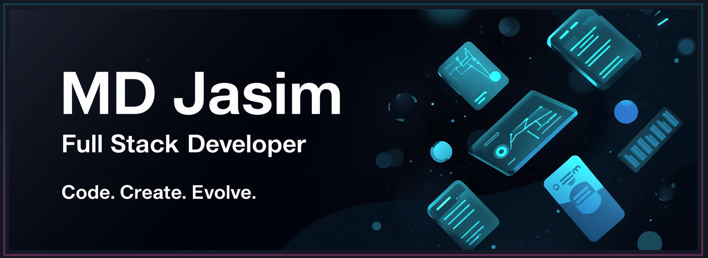

# Hi there 👋

## About Me 💡

- 🌱 Currently learning: **RDBMS**
- 💼 Working as a **Senior Web Instructor** at Programming Hero
- 📫 Reach me at: [ismailjosim@yahoo.com](mailto:ismailjosim@yahoo.com)
- 🌐 Portfolio: [https://ismailjosim.netlify.app](https://ismailjosim.netlify.app)
- 👨‍💻 Main languages: **JavaScript, C, C++, Python**
- 🚀 Open to collaborating on **frontend projects and MERN stack applications**

---

## 🛠️ Skills

### 🧱 Core Technologies

---

### 🔧 Development & Build Tools

---

### 💅 Styling & UI Tools

---

### ⚛️ JavaScript Frameworks & State Management

---

### 📱 Responsive Design

---

### 🌐 Data & API Tools

---

### 📦 Backend Technologies

---

### 🛠️ Database

---

### 📦 Version Control & Collaboration

---

## 🌐 Connect with Me

 <!-- You might want to add your user ID separately here -->

---

🚀 **Looking to collaborate?** Feel free to reach out via [email](mailto:ismailjosim@yahoo.com) or connect with me on the platforms above!

---

## 📊 GitHub Stats

  Here are some insights into my coding activity and languages:

